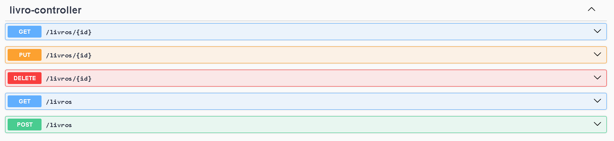

# Api-Serratec-Indidual
 ## :detective: Índice

* Sobre o Projeto
* Tecnologias utilizadas
* Endpoints 
* Autores do Projeto

## Sobre o Projeto
Este projeto tem como objetivo desenvolver um sistema de biblioteca utilizando o framework Spring. A aplicação permite realizar operações básicas de CRUD (Create, Read, Update, Delete), focadas no gerenciamento e cadastro de livros na biblioteca.

O projeto foi realizado durante a disciplina de Desenvolvimento de API Restful da Residência em TIC/Software do Serratec.

##  Tecnologias utilizadas
- Java
- Spring Tool Suite 4
- Maven
- H2

##  Endpoints

## Autor

- [Gabriel Pimentel](https://github.com/GabrielnPimentel)

 
